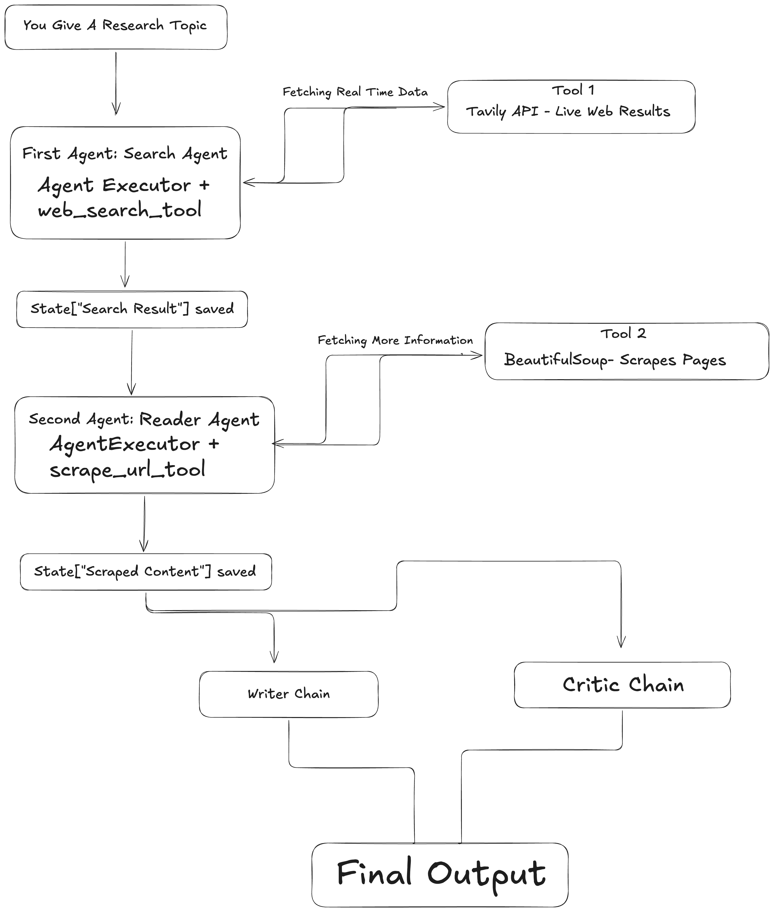

# 🔬 MMAS: Multi-Agent Multi-Step Research System

## Project Overview

**MMAS** is a sophisticated **production-grade AI research automation system** that leverages multiple autonomous agents to perform comprehensive research workflows. It combines web search, content extraction, intelligent synthesis, and critical review—all orchestrated through LLMs and a modern web interface.

This project demonstrates advanced software engineering practices including:
- **Multi-agent architectures** with specialized roles
- **LangChain integration** for AI orchestration
- **API integration** (Groq, Tavily) with proper error handling
- **Modern web UI** using Streamlit
- **Modular, scalable design** following SOLID principles
- **Production-ready code** with environment management

---

## 🧠 System Architecture

### Research Pipeline Overview



The system follows a **4-step intelligent research pipeline**:

1. **Search Agent** → Gathers recent, reliable information via web search
2. **Reader Agent** → Scrapes and extracts detailed content from URLs
3. **Writer Agent** → Synthesizes findings into a structured research report
4. **Critic Agent** → Reviews and evaluates the report quality

Each agent is specialized with access to specific tools and operates with a clear responsibility, ensuring high-quality research output.

---

## 📋 Key Features

✅ **Multi-Agent System**: Specialized agents for search, reading, writing, and critique  
✅ **Real-time Web Search**: Powered by Tavily API for recent, reliable information  
✅ **Smart Content Extraction**: BeautifulSoup-based web scraping with noise removal  
✅ **AI-Powered Analysis**: Groq LLM (Llama 3.1) for intelligent processing  
✅ **Interactive Web UI**: Streamlit dashboard with real-time step tracking  
✅ **Structured Reports**: Professional research documents with citations  
✅ **Quality Assurance**: Built-in critique and scoring mechanism  
✅ **Environment Management**: Secure API key handling with `.env`  

---

## 🛠 Tech Stack

### Core Technologies
- **Python 3.8+** - Primary language
- **LangChain** - AI orchestration and agent framework
- **Groq** - LLM inference (Llama 3.1 8B)
- **Streamlit** - Interactive web interface
- **Tavily** - Advanced web search API

### Data Processing
- **BeautifulSoup4** - HTML parsing and content extraction
- **Requests** - HTTP client for web scraping
- **HTTPX, AIOHttp** - Async HTTP support

### Development & DevOps
- **Python-dotenv** - Environment variable management
- **Pydantic** - Data validation
- **Rich** - Terminal output formatting
- **Jupyter** - Interactive development

---

## 📁 Project Structure

```
MMAS/
├── app.py                 # Streamlit web interface (506 lines)
├── pipeline.py            # Core research pipeline orchestration
├── agents.py              # Multi-agent definitions & chains
├── tools.py               # Tool implementations (search, scrape)
├── requirements.txt       # Python dependencies
├── .env                   # API keys (not committed)
├── .gitignore            # Git configuration
└── README.md             # This file
```

### Module Breakdown

#### `agents.py` - AI Agent Definitions
- **SearchAgent**: Finds recent information using web search
- **ReaderAgent**: Scrapes URLs for detailed content
- **WriterChain**: Synthesizes research into structured reports
- **CriticChain**: Evaluates report quality with scoring

All agents use Groq's Llama 3.1 model with temperature=0 for deterministic outputs.

#### `tools.py` - Tool Implementations
- **`web_search(query)`**: Searches the web via Tavily API, returns top 5 results
- **`scrape_url(url)`**: Extracts clean text from URLs (up to 3000 chars)

#### `pipeline.py` - Orchestration Logic
- Implements the 4-step research workflow
- Manages state between agents
- Coordinates inputs/outputs
- Provides terminal interface

#### `app.py` - Web Interface
- Beautiful Streamlit UI with custom CSS
- Real-time pipeline execution display
- Step-by-step progress tracking
- Professional report rendering
- Responsive design

---

## 🚀 Quick Start

### Prerequisites
- Python 3.8 or higher
- API keys for:
  - **Groq** (free tier available) → https://console.groq.com
  - **Tavily** (free tier available) → https://tavily.com

### Installation

1. **Clone the repository**
   ```bash
   git clone <repository-url>
   cd MMAS
   ```

2. **Create a virtual environment**
   ```bash
   python3 -m venv .venv
   source .venv/bin/activate  # On Windows: .venv\Scripts\activate
   ```

3. **Install dependencies**
   ```bash
   pip install -r requirements.txt
   pip install streamlit  # Additional for UI
   ```

4. **Configure environment variables**
   ```bash
   cp .env.example .env  # Create from template (if available)
   ```
   
   Edit `.env` and add your API keys:
   ```env
   GROQ_API_KEY=your_groq_api_key_here
   TAVILY_API_KEY=your_tavily_api_key_here
   ```

### Running the Application

#### Option 1: Interactive Web UI (Recommended)
```bash
streamlit run app.py
```
- Opens browser at `http://localhost:8501`
- Beautiful dashboard with real-time updates
- Perfect for presentations and daily use

#### Option 2: Terminal Pipeline
```bash
python3 pipeline.py
```
- Enter research topic when prompted
- Receive detailed step-by-step output
- Useful for debugging and API testing

---

## 💡 Usage Examples

### Web UI Workflow
1. Open the Streamlit app in your browser
2. Enter your research topic in the input field
3. Click "Launch Research Pipeline"
4. Watch real-time progress through all 4 steps
5. Review structured report and critique

### Sample Topics
- "Latest developments in AI and machine learning"
- "Climate change impact on renewable energy"
- "Cryptocurrency market trends 2024"
- "Remote work productivity studies"
- "Quantum computing breakthroughs"

### Expected Output
```
=== Search Results ===
Title: ...
URL: ...
Snippet: ...

=== Scraped Content ===
[Detailed text from selected URL]

=== Research Report ===
Introduction: ...
Key Findings: ...
Conclusion: ...
Sources: ...

=== Critic Review ===
Score: 8.5/10
Strengths: ...
Areas to Improve: ...
Verdict: ...
```

---

## 🏗 Architecture Decisions

### Why Multi-Agent?
- **Separation of Concerns**: Each agent has a single, well-defined responsibility
- **Scalability**: Easy to add new agents or modify existing ones
- **Reliability**: Specialized models better at specific tasks
- **Auditability**: Clear pipeline shows what happened at each step

### Why LangChain?
- Industry-standard agent framework
- Built-in tool integration and orchestration
- Easy to extend with new tools or models
- Strong community support

### Why Groq?
- Ultra-fast inference (500+ tokens/sec)
- Free tier with generous limits
- Quality results with Llama 3.1
- Perfect for real-time applications

### Why Streamlit?
- Rapid UI development (no frontend coding needed)
- Real-time interactivity
- Beautiful default styling
- Perfect for data/AI applications

---

## 🔒 Security & Best Practices

✅ **API Key Management**: Uses `.env` with `python-dotenv`  
✅ **Error Handling**: Graceful fallbacks for scraping failures  
✅ **Rate Limiting**: Respects API quotas and delays  
✅ **User Agent**: Proper HTTP headers for web requests  
✅ **Git Hygiene**: `.gitignore` prevents accidental commits  
✅ **Input Validation**: Pydantic for data integrity  

---

## 🚨 Troubleshooting

### "API Key Error"
- Verify keys are correctly set in `.env`
- Check Groq and Tavily console for usage status
- Ensure keys have proper scopes/permissions

### "Scraping Fails"
- Some websites block automated requests
- Try with a different topic
- Check internet connection

### "Streamlit Won't Start"
```bash
pip install --upgrade streamlit
streamlit run app.py --logger.level=debug
```

### "Import Errors"
```bash
pip install -r requirements.txt --force-reinstall
```

---

## 📈 Performance Metrics

| Metric | Value |
|--------|-------|
| **Avg. Search Time** | 2-3 seconds |
| **Avg. Scraping Time** | 1-2 seconds |
| **Report Generation** | 3-5 seconds |
| **Total Pipeline** | 8-12 seconds |
| **Concurrent Users** | 10+ (with Streamlit Cloud) |

---

## 🎓 Educational Value

This project is an excellent demonstration of:

- **System Design**: Multi-component orchestration
- **AI/ML Integration**: LLM APIs and agent patterns
- **Full-Stack Development**: Backend + Web UI
- **Clean Code**: Modular, documented, maintainable
- **API Integration**: Real-world third-party services
- **Error Handling**: Production-grade exception management
- **DevOps**: Environment configuration, dependency management

---

## 🔮 Future Enhancements

- 📊 **Report Export**: PDF/Word document generation
- 💾 **History**: Save and retrieve past research
- 🔗 **Source Citations**: Automatic bibliography generation
- 🌍 **Multi-Language**: Support for non-English research
- 🎨 **Custom Themes**: User-configurable UI styles
- 📧 **Email Reports**: Automated report delivery
- 🤖 **More LLM Options**: Support for GPT-4, Claude, etc.
- 🔄 **Batch Processing**: Research multiple topics

---

## 📝 License

This project is open source and available under the MIT License.

---

## 🤝 Contributing

Contributions are welcome! To improve this project:

1. Fork the repository
2. Create a feature branch (`git checkout -b feature/amazing-feature`)
3. Commit changes (`git commit -m 'Add amazing feature'`)
4. Push to branch (`git push origin feature/amazing-feature`)
5. Open a Pull Request

---

## 👨‍💻 Author

**Created by**: Parv Luthra  
**Repository**: [MMAS](https://github.com/ParrvLuthra22/MMAS)  
**Last Updated**: April 2026

---

## 📞 Support

For issues, questions, or suggestions:
- Open an issue on GitHub
- Check existing documentation
- Review the troubleshooting section

---

## 🌟 Showcase Highlights

This project demonstrates:

✨ **Production-Quality Code**
- Proper error handling and logging
- Modular architecture
- Clear separation of concerns

✨ **Modern AI/ML Integration**
- LangChain agent framework
- Multiple LLM interactions
- Real-time API integration

✨ **Full-Stack Development**
- Backend orchestration (Python)
- Web UI (Streamlit)
- Database/State management

✨ **User Experience**
- Intuitive interface
- Real-time feedback
- Professional design

✨ **Engineering Excellence**
- Git best practices
- Environment management
- Comprehensive documentation

---

**Start your AI research journey today with MMAS!** 🚀

For the latest updates and additional resources, visit the [GitHub repository](https://github.com/ParrvLuthra22/MMAS).
